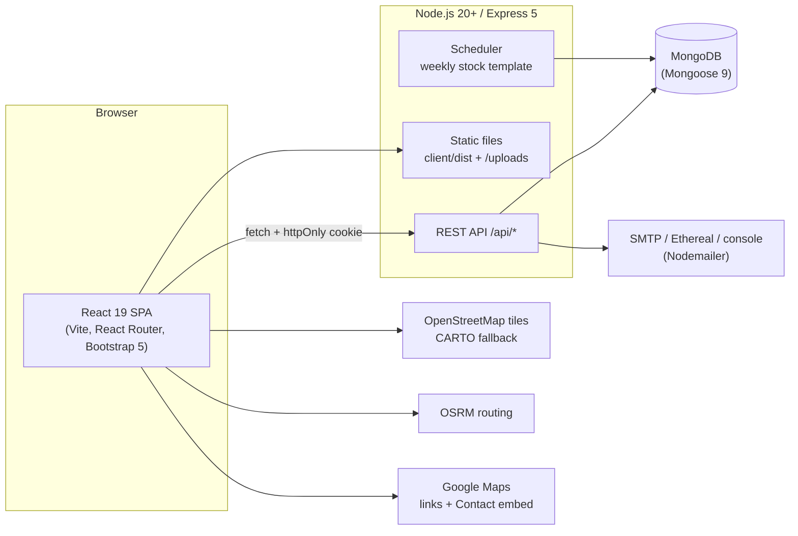
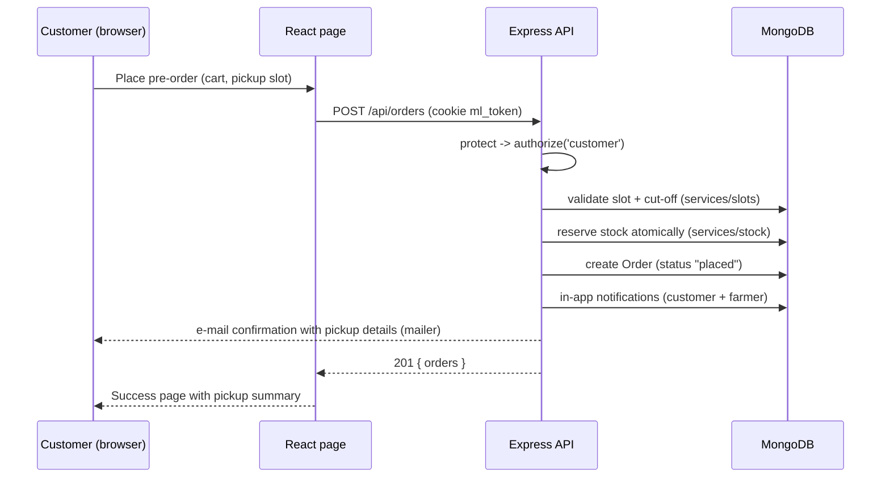
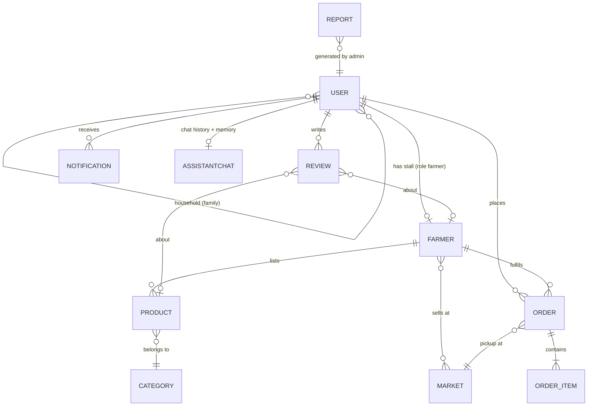
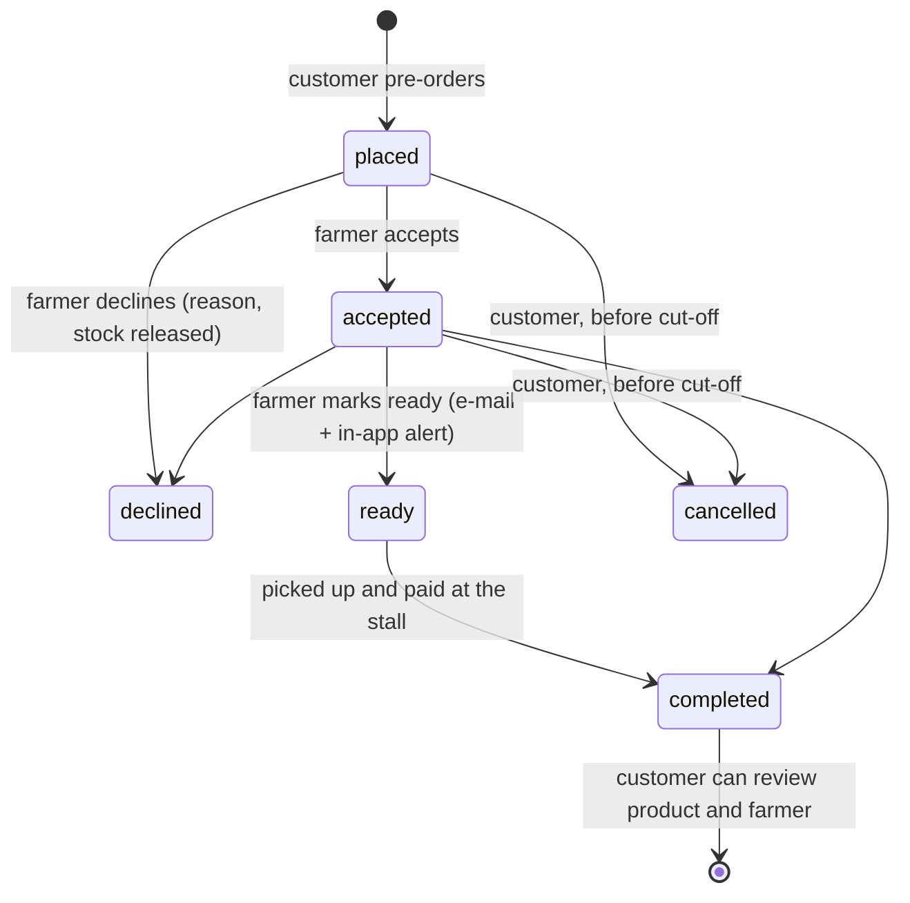

# MarketLink – Architecture

MarketLink (theme **eGreen Basket**) is a MERN web application that connects farmers-market
farmers with customers: farmers publish weekly stock and pickup windows, customers pre-order
and collect at the stall, and an administrator manages the platform.

## 1. System overview



- **One deployable server.** In production Express serves the built React app (`client/dist`)
  and the API from the same origin, so no CORS is needed. In development Vite (port 5173)
  proxies `/api` and `/uploads` to Express (port 5000).
- **Stateless API.** The session is a JWT stored in the `ml_token` httpOnly, SameSite cookie,
  so any number of API instances can run behind a load balancer.
- **No payment gateway, pickup only** (SRS 1.5): orders are paid in person at the stall.

## 2. Repository layout

```
MarketLink/
├── client/                 React front end (Vite)
│   ├── public/             favicon, 3D illustrations
│   └── src/
│       ├── api/            fetch wrapper (cookies, JSON errors)
│       ├── components/     layout (navbar, drawer, tab bar), cards, maps, charts, chat, orders
│       ├── context/        Auth, Cart (localStorage), Toast
│       ├── hooks/          useFetch, useFavorite, useScrollReveal, ...
│       ├── pages/          public/, auth/, customer/, farmer/, admin/
│       ├── styles/         SCSS design system on top of Bootstrap 5
│       └── utils/          formatting, image helpers
├── server/
│   ├── src/
│   │   ├── config/         env, database connection
│   │   ├── controllers/    one file per area (auth, orders, farmer portal, admin, ...)
│   │   ├── middleware/     auth + RBAC, uploads (Multer), error handler
│   │   ├── models/         Mongoose schemas
│   │   ├── routes/         all REST routes in routes/index.js
│   │   ├── services/       business logic (slots, stock, orders, notify, mailer, reports, assistant, scheduler)
│   │   ├── seed/           demo data, seed script, JSON export
│   │   └── utils/          constants, dates, helpers
│   └── uploads/            seed illustrations, product photos, farmer uploads
├── database/               mongosh schema script + sample-data/*.json (test data)
└── docs/                   these documents
```

## 3. Request flow



Every route goes through the same middleware chain:

| Middleware | Purpose |
| --- | --- |
| `helmet` | security headers, CSP (allows OSM/CARTO tiles, OSRM, Google embed), `Referrer-Policy: strict-origin-when-cross-origin` so OpenStreetMap accepts tile requests |
| `compression` | gzip responses |
| `express-rate-limit` | `authLimiter` (20 failed logins / 15 min), `formLimiter` (40 sign-ups or messages / 15 min), `chatLimiter` (30 assistant messages / min) |
| `optionalAuth` / `protect` | read the JWT cookie; `protect` rejects guests with 401 |
| `authorize(...roles)` | role-based access control (customer, farmer, admin) → 403 |
| `loadFarmer` / `requireApprovedFarmer` | a farmer must be approved before listing products or handling orders |
| `error` | turns `AppError`, validation and cast errors into clean JSON messages |

## 4. Data model



| Collection | Key fields |
| --- | --- |
| `users` | name, email (unique, login name), password (bcrypt hash, never returned), phone, address, city, role, status (active / pending / suspended / inactive), favoriteFarmers, favoriteProducts, savedMarkets, household (family sharing), reset-token hash + expiry |
| `farmers` | user, stallName, slug, contactPerson, phone, address, city, bio, categories, tags (farming practices), markets, operatingDays, pickupWindows (market, day, start, end), slotMinutes, slotCapacity, orderCutoffHours, blockedDates, latitude/longitude, logo, cover, weekly-template settings |
| `markets` | name, slug, address, city, operatingDays, openTime, closeTime, latitude, longitude, mapProvider, mapLink, image |
| `categories` | name, slug, description, color, icon, sortOrder, isActive |
| `products` | farmer, category, name, description, price, unit, quantityAvailable, templateQuantity, status (available / sold_out / unavailable), image, imageCredit, markets/days (copied for fast filters), rating, totalSold, moderation flags |
| `orders` | orderNumber, customer, farmer, market, items (product, name, price, unit, quantity – price frozen at order time), totalAmount, pickupDate, pickupSlot, pickupAt, cutoffAt, status + statusHistory |
| `reviews` | customer, order, type (product / farmer), product or farmer, rating 1–5, comment, response (farmer reply), isRemoved (moderation) |
| `notifications` | user, type, title, message, link, read |
| `announcements` | title, message, audience, isActive, createdBy (site banner + in-app notification) |
| `reports` | reportType (platform_overview, orders_summary, revenue_by_market, top_farmers), from/to, data, generatedBy, generatedAt |
| `contactmessages` | name, email, subject, message, status |
| `assistantchats` | user (unique), last 60 messages, memory (market, farmer, product, day, city, name, last intent) |

Validators and indexes for every collection are in `database/marketlink-schema.mongodb.js`.

## 5. Core services

| Service | Responsibility |
| --- | --- |
| `slots.js` | turns pickup windows into time slots, applies capacity, blocked dates and the order cut-off; `validatePickup` rechecks everything on the server |
| `stock.js` | reserves stock atomically when an order is placed, releases it on cancel/decline, applies the weekly template, sends restock alerts to fans |
| `orders.js` | order numbers, "can the customer still modify?" rule (placed/accepted and before cut-off), status history, route-friendly pickup details |
| `notify.js` + `mailer.js` | in-app notifications and e-mails (console, Ethereal test inbox or real SMTP) |
| `reports.js` | admin reports saved to the `reports` collection (printable, CSV export in the UI) |
| `assistant.js` | rule-based AI assistant with conversation memory (see below) |
| `scheduler.js` | runs hourly; at the start of a new week re-applies the stock template for farmers with auto-apply |
| `ratings.js` | recalculates product and farmer ratings after reviews change |

## 6. Order life-cycle



## 7. AI assistant

- `POST /api/assistant { message, memory? }` → `{ reply, cards, suggestions, memory }`.
- Intent rules detect timings, pickup windows, farmer availability, product search/details,
  payment/delivery/cancellation FAQs and "my orders"; entities (markets, farmers, categories,
  days, cities) are matched against live data.
- **Memory:** each answer returns what the conversation is about. Follow-ups such as
  "which farmers are there?", "what about Sunday?", "is it in stock?" use it. The user can say
  "my name is …", "I live in Lahore", "what do you remember?" and "forget everything".
- **History:** signed-in users' last 60 messages and memory are stored in `assistantchats`
  (`GET/DELETE /api/assistant/history`); guests keep them in `localStorage`. The chat header has
  a Clear chat button that deletes both.

## 8. Maps

- Leaflet + React-Leaflet with OpenStreetMap tiles; after repeated tile errors the map switches to
  CARTO tiles automatically (`components/map/BaseTiles.jsx`).
- Markers for markets and farmer stalls, in-app driving route through OSRM, and Google Maps /
  OpenStreetMap direction links. Farmers drop a pin (lat/lng) on a map when registering.
- Contact page embeds Google Maps for Aptech Learning Centre, F.B. Area, Karachi.

## 9. Configuration and deployment

- `server/.env`: `PORT`, `NODE_ENV`, `CLIENT_URL`, `MONGO_URI`, `JWT_SECRET`, `JWT_EXPIRES_IN`,
  `CURRENCY`, `TZ` (market time zone, default Asia/Karachi), `SMTP_HOST`/`SMTP_PORT`/`SMTP_USER`/
  `SMTP_PASS`/`MAIL_FROM`.
- `render.yaml` deploys the whole app as one Render web service (build client, start server);
  the database can be MongoDB Atlas.
- Scaling: stateless API + indexed collections; product lists are paginated (12 per page) and
  every page of the React app is lazy-loaded.
