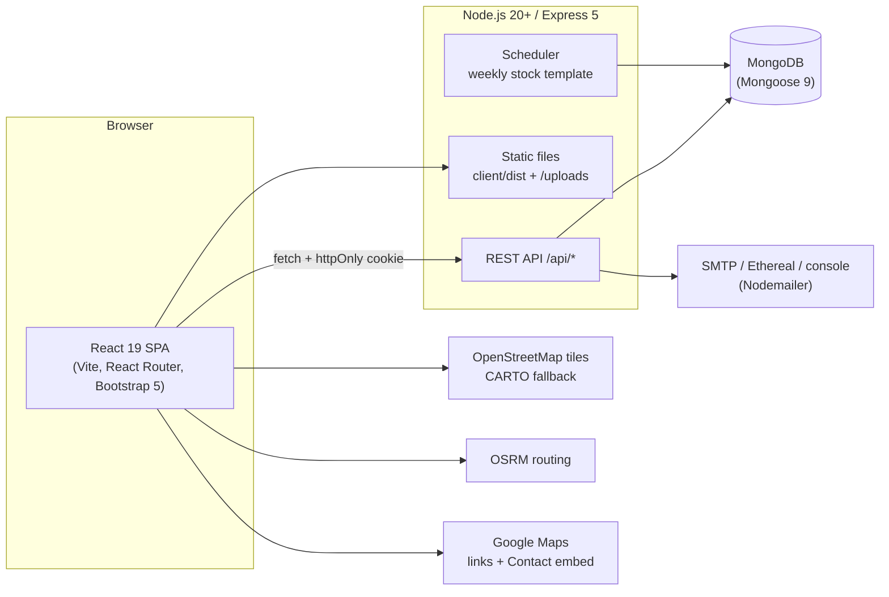
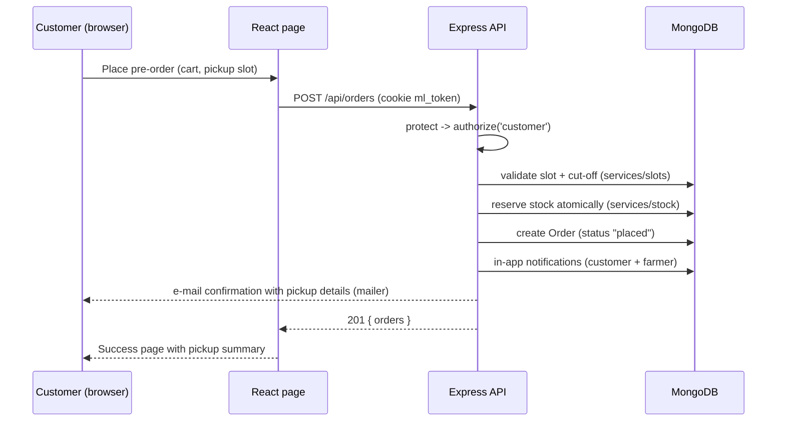
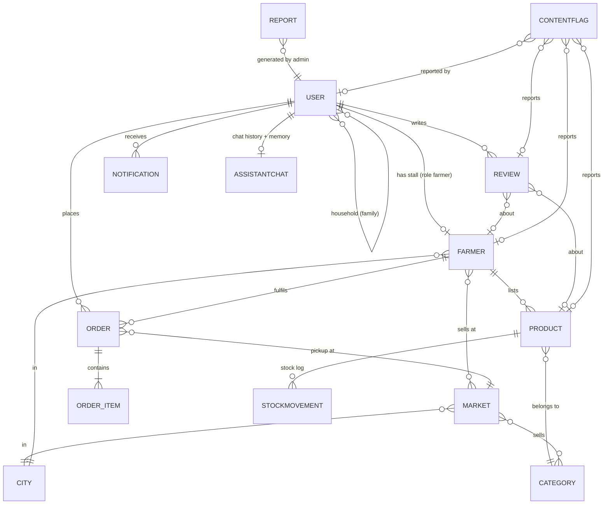
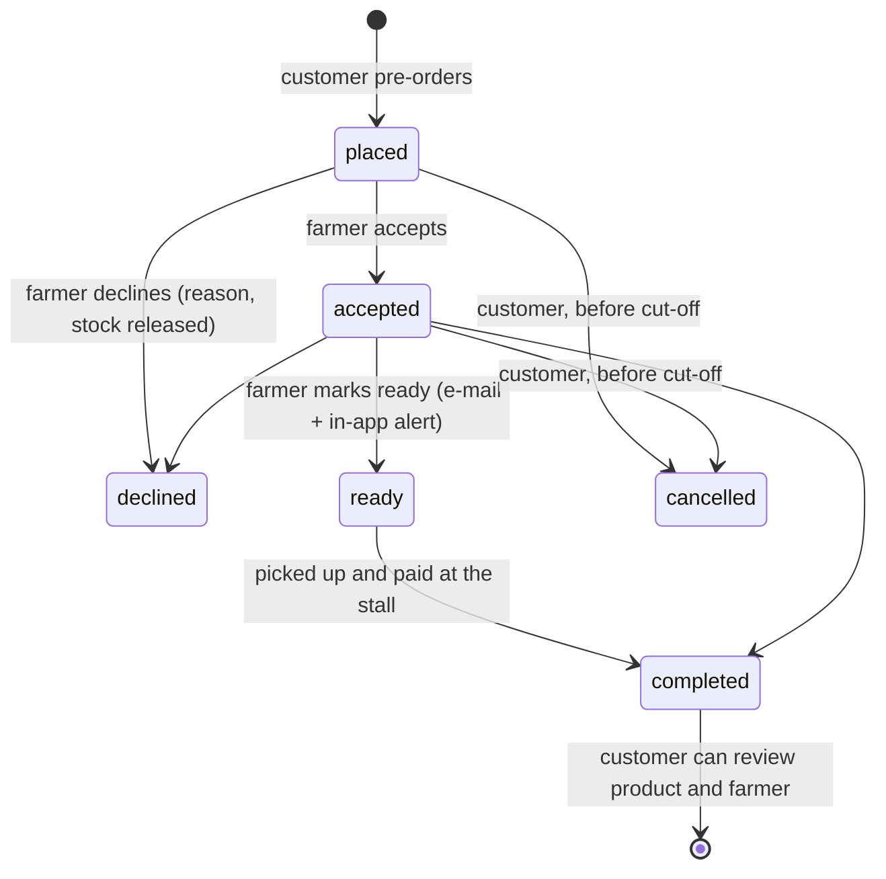

# MarketLink – Architecture

MarketLink (theme **eGreen Basket**) is a MERN web application that connects farmers-market
farmers with customers: farmers publish weekly stock and pickup windows, customers pre-order
and collect at the stall, and an administrator manages the platform.

## 1. System overview



- **One deployable server.** In production Express serves the built React app (`client/dist`)
  and the API from the same origin, so no CORS is needed. In development Vite (port 5173)
  proxies `/api` and `/uploads` to Express (port 5000).
- **Stateless API.** The session is a JWT stored in the `ml_token` httpOnly, SameSite cookie,
  so any number of API instances can run behind a load balancer.
- **No payment gateway, pickup only** (SRS 1.5): orders are paid in person at the stall.

## 2. Repository layout

```
MarketLink/
├── client/                 React front end (Vite)
│   ├── public/             favicon, brand/ (logo PNGs, icons, og-image.jpg share picture), images/hero (banner photos), media/ (video), manifest.webmanifest
│   └── src/
│       ├── api/            fetch wrapper (cookies, JSON errors)
│       ├── components/     layout (navbar, drawer, tab bar), admin (AdminLayout, DataGrid, FilterBar,
│       │                   order + account modals), legal (terms), cards, maps, charts, chat, orders
│       ├── context/        Auth, Cart (localStorage), Toast
│       ├── hooks/          useFetch, useFavorite, useScrollReveal, ...
│       ├── pages/          public/, auth/, customer/, farmer/, admin/
│       ├── styles/         SCSS design system on top of Bootstrap 5
│       └── utils/          formatting, image helpers, product links, DataTables cell helpers
├── server/
│   ├── src/
│   │   ├── config/         env, database connection
│   │   ├── controllers/    one file per area (auth, orders, farmer portal, admin, ...)
│   │   ├── middleware/     auth + RBAC, uploads (Multer), error handler
│   │   ├── models/         Mongoose schemas
│   │   ├── routes/         all REST routes in routes/index.js
│   │   ├── services/       business logic (slots, stock, orders, notify, mailer, reports, assistant,
│   │   │                   describe (AI product descriptions), migrations, scheduler)
│   │   ├── scripts/        mail-test.js (npm run mail:test)
│   │   ├── assets/         logo for e-mails
│   │   ├── seed/           demo data, seed script, JSON export
│   │   └── utils/          constants, dates, helpers, slug, dataTable (DataTables server-side processing)
│   └── uploads/            product photos (photos/, square thumbs in photos/thumbs), market and farm photos (places/), farmer uploads, profile photos (avatars)
├── database/               mongosh schema script + sample-data/*.json (test data)
└── docs/                   these documents
```

## 3. Request flow



Every route goes through the same middleware chain:

| Middleware | Purpose |
| --- | --- |
| `helmet` | security headers, CSP (allows OSM/CARTO tiles, OSRM, Google embed), `Referrer-Policy: strict-origin-when-cross-origin` so OpenStreetMap accepts tile requests |
| `compression` | gzip responses |
| `express-rate-limit` | `authLimiter` (20 failed logins / 15 min), `formLimiter` (40 sign-ups or messages / 15 min), `chatLimiter` (30 assistant messages / min) |
| `optionalAuth` / `protect` | read the JWT cookie; `protect` rejects guests with 401 |
| `authorize(...roles)` | role-based access control (customer, farmer, admin) → 403 |
| `loadFarmer` / `requireApprovedFarmer` | a farmer must be approved before listing products, pickup settings, AI descriptions or handling orders; the UI also hides these pages until approval |
| `error` | turns `AppError`, validation and cast errors into clean JSON messages |

## 4. Data model



| Collection | Key fields |
| --- | --- |
| `users` | name, email (unique, login name), password (bcrypt hash, never returned), phone, address, city, role, status (active / pending / suspended / inactive), avatar (profile photo), favoriteFarmers, favoriteProducts, savedMarkets, household (family sharing), termsAcceptedAt + termsVersion, reset-token hash + expiry |
| `farmers` | user, stallName, slug, contactPerson, phone, address, city, bio, categories, tags (farming practices), markets, operatingDays, pickupWindows (market, day, start, end), slotMinutes, slotCapacity, orderCutoffHours, blockedDates, latitude/longitude, logo, cover, weekly-template settings |
| `markets` | name, slug, address, city (from `cities`), categories (what is sold there), operatingDays, openTime, closeTime, latitude, longitude, mapProvider, mapLink, image |
| `cities` | name (unique), slug, province, latitude/longitude (city centre), isActive, sortOrder – source of every city dropdown |
| `categories` | name, slug, description, color, icon, sortOrder, isActive |
| `products` | farmer, category, name, slug (readable URL `/products/sindhri-mangoes`), description, price, unit, quantityAvailable, templateQuantity, lowStockThreshold (alert level) + lowStockAlertedAt / soldOutAlertedAt, status (available / sold_out / unavailable), metaTitle, metaDescription, keywords (SEO, also used by the search), image (a real photo from `uploads/photos`), imageCredit, gallery (up to 4 extra photos with credits), markets/days (copied for fast filters), rating, totalSold, moderation flags |
| `orders` | orderNumber, customer, farmer, market, items (product, name, price, unit, quantity – price frozen at order time), totalAmount, pickupDate, pickupSlot, pickupAt, cutoffAt, placedBy (customer / admin), status + statusHistory |
| `reviews` | customer, order (for buyers), verified (true = tied to the customer's completed order), type (product / farmer), product or farmer, rating 1–5, comment, response (farmer reply), isRemoved (moderation) |
| `notifications` | user, type (order, restock, stock, announcement, review, account, moderation, system), title, message, link, read |
| `announcements` | title, message, audience, months (1-12, empty = all year; the banner only shows in these months), link, isActive, createdBy (site banner + in-app notification) |
| `subscribers` | email (unique), name, source (home / footer / checkout), status (subscribed / unsubscribed), token (unsubscribe link), unsubscribedAt – the newsletter list |
| `reports` | reportType (platform_overview, orders_summary, revenue_by_market, top_farmers, sales_by_category, customer_activity, inventory_status, city_overview, reviews_moderation), from/to, data, generatedBy, generatedAt |
| `stockmovements` | farmer, product, productName, unit, change (+/-), quantityAfter, type (initial, restock, adjustment, waste, stall_sale, correction, template, order_reserved, order_released, order_changed), reason, order + orderNumber, by (farmer / customer / admin / system) – the inventory log |
| `contentflags` | targetType (review / product / farmer) + the target ids, reason (spam, offensive, misleading, wrong_info, other, auto_language), note, reporter (empty for the word filter), status (open / resolved / dismissed), action (removed, restored, suspended), resolutionNote, resolvedBy, resolvedAt – the moderation queue |
| `contactmessages` | name, email, subject, message, status |
| `assistantchats` | user (unique), last 60 messages, memory (market, farmer, product, day, city, name, last intent) |

Validators and indexes for every collection are in `database/marketlink-schema.mongodb.js`.

## 5. Core services

| Service | Responsibility |
| --- | --- |
| `slots.js` | turns pickup windows into time slots, applies capacity, blocked dates and the order cut-off; `validatePickup` rechecks everything on the server |
| `stock.js` | reserves stock atomically when an order is placed, releases it on cancel/decline, applies the weekly template, sends restock alerts to fans |
| `inventory.js` | writes the stock log (`stockmovements`) for orders, cancellations, changes, the template and manual adjustments; low-stock and sold-out alerts (e-mail + in-app, once per level until restocked); stock reserved by open pre-orders |
| `moderation.js` | word filter: reviews with offensive words are held (hidden) and put in the moderation queue |
| `orders.js` | order numbers, "can the customer still modify?" rule (placed/accepted and before cut-off), status history, route-friendly pickup details |
| `notify.js` + `mailer.js` | in-app notifications and e-mails (console, Ethereal test inbox or real SMTP such as Gmail); branded HTML with the logo and an action button, SMTP check at start-up with clear error hints, `npm run mail:test` |
| `describe.js` | "Write with AI" product descriptions and "Generate with AI" farm descriptions: Claude (when `ANTHROPIC_API_KEY` is set) or a built-in writer with a produce knowledge base |
| `migrations.js` | small start-up data fixes (readable URLs for older products, `verified` on older reviews) and `syncValidators()`: extends the allowed values (enums) and relaxes required fields of MongoDB validators created by an older schema script, so new values never fail with “Document failed validation” |
| `seo.js` | per-page `<title>`, description, canonical, Open Graph / X tags and JSON-LD written into index.html by the server (404 for unknown addresses, products, farmers, markets); Urdu pages (`lang="ur" dir="rtl"`, Urdu title / description, hreflang, og:locale); `/sitemap.xml` (both languages) and `/robots.txt` |
| `productSchema.js` | the AI product schema: answer-first summary, season, storage tip, uses, Urdu name and Urdu tips, written by Claude (with a key) or a built-in writer when a product is added or changed; used in the Product JSON-LD and the Quick facts |
| `urdu.js` | the page language (`?lang=`, cookie `ml_lang`, admin always English) and the Urdu titles and descriptions of every page for the server |
| `reports.js` | platform-wide admin reports saved to the `reports` collection (printable, CSV / Excel export in the UI); the newer reports return columns + rows + an optional chart so the UI renders them generically |
| `assistant.js` + `assistantUrdu.js` | rule-based AI assistant with conversation memory, in English and Urdu (see below) |
| `scheduler.js` | runs hourly; at the start of a new week re-applies the stock template for farmers with auto-apply |
| `ratings.js` | recalculates product and farmer ratings after reviews change |

## 6. Admin area

- **Own layout** (`components/admin/AdminLayout.jsx`): no public navbar, footer or chat; a dark
  sidebar that collapses to icons (remembered in the browser) and becomes a drawer on phones, a top
  bar with *Place order*, *Add farmer*, notifications and the account menu. Reports is the last item.
- **DataTables** (datatables.net 3 with the Bootstrap 5 styling, Responsive and Buttons extensions):
  `components/admin/DataGrid.jsx` wraps `datatables.net-react`. Admin tables use *server-side
  processing*: the grid posts DataTables' request (`draw, start, length, search, order, columns`)
  plus our `filters` to `POST /api/admin/tables/:name`; `utils/dataTable.js` turns it into a
  MongoDB query and answers `{ draw, recordsTotal, recordsFiltered, data }`. Tables: farmers,
  customers, orders, products, reviews, messages. Analytics tables use client-side DataTables.
  Every grid has search, sorting, paging (10 … All), CSV / Excel / Print export and filter controls.
- **Admin actions:** create farmer and customer accounts (`POST /api/admin/farmers|customers`,
  invite e-mail with a 3-day password link when no password is typed), place an order for a
  customer (`POST /api/admin/orders`, same stock and slot checks as the checkout, `placedBy: admin`),
  manage the cities table.
- **Analytics:** `GET /api/admin/customers/:id/overview` (profile, totals, purchases per farmer,
  orders per month) and `GET /api/admin/analytics/purchases` (who bought what from which farmer:
  pairs, top customers, top farmers, top products, customer × farmer matrix, daily amounts, with
  date, status, city, market, farmer and category filters).

## 7. Order life-cycle



## 8. AI assistant

- `POST /api/assistant { message, memory?, lang? }` → `{ reply, cards, suggestions, memory }`.
- **Urdu** (`lang: 'ur'`): an Urdu question is turned into the English keywords the rules know
  (`assistantUrdu.js`; products are recognised by their Urdu names), and the answer is written in Urdu
  (Urdu day, unit, status, city and category names). The language of each request is kept in
  AsyncLocalStorage, so the rules pick the Urdu sentence with `L(english, urdu)`.
- Intent rules detect timings, pickup windows, farmer availability, product search/details,
  payment/delivery/cancellation FAQs and "my orders"; entities (markets, farmers, categories,
  days, cities) are matched against live data.
- **Memory:** each answer returns what the conversation is about. Follow-ups such as
  "which farmers are there?", "what about Sunday?", "is it in stock?" use it. The user can say
  "my name is …", "I live in Lahore", "what do you remember?" and "forget everything".
- **History:** signed-in users' last 60 messages and memory are stored in `assistantchats`
  (`GET/DELETE /api/assistant/history`); guests keep them in `localStorage`. The chat header has
  a Clear chat button that deletes both.

## 9. Languages (English and Urdu)

- **Texts:** `client/src/i18n/index.js` has `t(text, vars)`: the English text is the key and
  `ur.js` holds the Urdu. `rich()` keeps `<b>` parts bold, `tServer()` shows server messages
  (notifications, errors) in Urdu by matching the templates in `i18n/server.js`, and helpers such as
  `productName()`, `categoryName()`, `unitName()` and `localText(doc, 'bio')` pick the Urdu field of a
  document when there is one.
- **Switch:** `LanguageProvider` + `LanguageSwitch` (navbar, phone menu, dashboards, footer). The choice
  is kept in localStorage and the `ml_lang` cookie; `?lang=ur` in an address also switches. The admin
  area is always English.
- **Right to left:** `<html lang="ur" dir="rtl">`. postcss-rtlcss mirrors our SCSS and the DataTables CSS
  at build time into `:where(html[dir="rtl"])` rules (see `vite.config.js`); `styles/_urdu.scss` adds the
  Urdu fonts and the few things a mirror cannot know (icons that point, maps and charts that stay left to right).
- **Content:** Urdu fields next to the English ones: `Product.nameUr / descriptionUr / aiSchema.*Ur`,
  `Category.nameUr`, `Faq.questionUr / answerUr`, `Announcement.titleUr / messageUr`, `Farmer.bioUr`,
  `Market.descriptionUr`, `Order.items.nameUr`. The seed fills them; `migrations.js` fills them in older
  databases when the English text is still the demo text.
- **Server:** pages are sent in the right language from the first paint (`Vary: Cookie`); the sitemap lists
  both languages with `hreflang` links.

## 10. Maps

- Leaflet + React-Leaflet with OpenStreetMap tiles; after repeated tile errors the map switches to
  CARTO tiles automatically (`components/map/BaseTiles.jsx`).
- Markers for markets and farmer stalls, in-app driving route through OSRM, and Google Maps /
  OpenStreetMap direction links. Farmers drop a pin (lat/lng) on a map when registering.
- Contact page embeds Google Maps for Aptech Learning Centre, F.B. Area, Karachi.

## 11. Configuration and deployment

- `server/.env`: `PORT`, `NODE_ENV`, `CLIENT_URL`, `MONGO_URI`, `JWT_SECRET`, `JWT_EXPIRES_IN`,
  `CURRENCY`, `TZ` (market time zone, default Asia/Karachi), `SMTP_HOST`/`SMTP_PORT`/`SMTP_SECURE`/
  `SMTP_USER`/`SMTP_PASS`/`MAIL_FROM`/`APP_URL` (e-mail), `ANTHROPIC_API_KEY`/`ANTHROPIC_MODEL`
  (optional AI descriptions).
- `render.yaml` deploys the whole app as one Render web service (build client, start server);
  the database can be MongoDB Atlas.
- Scaling: stateless API + indexed collections; product lists are paginated (12 per page) and
  every page of the React app is lazy-loaded.
