# MarketLink – Project Report

**TechWiz 2026 · End-to-End Web Solutions · Team Omniverse (Aptech Learning Centre, F.B. Area, Karachi)**

> **Note for the team (please read before submitting).** The SRS (section "Important Note Regarding AI
> Usage") does not allow documentation that is fully produced by an AI tool. This report is a **draft**
> that Claude Code (an AI coding assistant) prepared from the project's code, database and test runs so
> that the facts, tables and diagrams are correct. Before you submit it, read every section, rewrite the
> text in your own words, add your own design reasoning and team details, and keep "Claude Code
> (Anthropic)" in the list of AI tools you used (section 11). The report contains no source code, as the
> SRS asks.

---

## 1. Problem definition

Local farmers markets in Pakistani cities (for example the weekend markets in Clifton, DHA or F-9 Park)
work only face to face. That causes the same problems every week:

- **Customers do not know what is there before they go.** They cannot see which farmers come on which
  day, what they have picked this week, the price, or whether it is already sold out.
- **Farmers guess how much to bring.** Without orders in advance they either bring too much (waste) or
  too little (lost sales), and they cannot tell regular customers that they will not come.
- **Popular produce sells out early** and people who arrive later leave with nothing.
- **Nobody manages the markets online.** There is no single place for market days and hours, the
  stall locations, trusted reviews or complaints.

**MarketLink** puts the farmers market online without changing how it works: farmers publish their
weekly stock, prices and pickup windows; customers find markets and farmers on a map, reserve products
with a pre-order for a pickup time slot, and **pay the farmer in person at pickup**. An administrator
approves farmers, manages markets and categories, moderates content and reads platform reports.

### 1.1 Objectives

1. Let customers browse markets, farmers and products by location, day, category and price, with a map
   and directions to the pickup point.
2. Let customers pre-order against the farmer's real stock for a pickup slot, then track, modify or
   cancel the order before the farmer's cut-off time.
3. Give farmers a simple dashboard for weekly stock (with a recurring template), pickup windows,
   pre-orders, sales insights and replies to reviews.
4. Give the administrator control over users, markets, categories, content, announcements and reports.
5. Work well on phones, in English and in Urdu, with secure, role-based access.

### 1.2 Scope

| In scope | Out of scope (SRS 1.5) |
| --- | --- |
| Customer, farmer and admin areas with role-based access | Online payment (payment is made at pickup) |
| Markets, farmers, products, categories, cities | Delivery or courier logistics (pickup only) |
| Pre-orders with pickup slots and cut-off times | Checking farmer identity, licences or organic certificates |
| Reviews, ratings, favourites, restock reminders | Native mobile apps (the website is responsive instead) |
| Maps (OpenStreetMap), directions, notifications and e-mail | |
| AI assistant (English, Urdu, Roman Urdu) | |

### 1.3 Users

| User | What they do |
| --- | --- |
| **Guest** | Browses markets, farmers and products, uses the map and the assistant, can check out as a guest (an account is made and the password e-mailed) |
| **Customer** | Everything a guest can, plus a dashboard, order tracking, changes and cancellations, favourites, family sharing, reviews, restock reminders and notifications |
| **Farmer** | Registers a stall (approved by the admin), manages products, weekly stock, pickup windows, closed dates, pre-orders, sales insights and review replies |
| **Administrator** | Separate dashboard: farmers, customers, markets, cities, categories, products, reviews, moderation, announcements, the home page offer banner, messages, newsletter, FAQs, reports and farmer rankings |

---

## 2. Design specifications

### 2.1 Architecture

MarketLink is a **MERN** application (MongoDB, Express, React, Node.js) with the multi-tier structure the
SRS describes: the browser runs the React app, the Express server exposes a REST API and serves the built
app, and MongoDB stores the data.

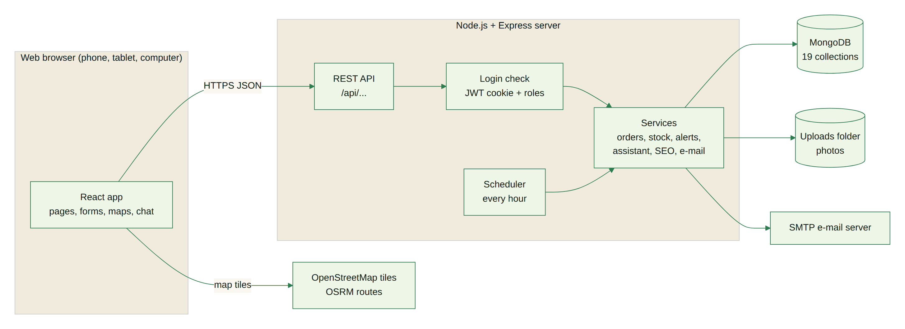

| Layer | Technology | Notes |
| --- | --- | --- |
| Presentation | React 19 (Vite), React Router 7, Bootstrap 5 with a custom theme, Bootstrap Icons, Recharts, DataTables, Leaflet maps, intl-tel-input | 77 routes (public, customer, farmer, admin); English and Urdu (right to left) |
| Application | Node.js 20+, Express 5 | 146 REST endpoints under `/api`, input checks on every request, rate limits on login, chat and AI features |
| Security | JWT in an httpOnly cookie, bcrypt password hashes, Helmet headers, CORS, role checks on every protected route | Customer, farmer and admin routes are separated on the server, not only hidden in the menu |
| Data | MongoDB with the Mongoose ODM | 19 collections with validation rules and indexes (section 4) |
| Services | Nodemailer (SMTP e-mail), an hourly scheduler, OpenStreetMap tiles and OSRM routes | Weekly stock template, low-stock alerts, "market open today" notices |

### 2.2 Modules

| Module | Main functions |
| --- | --- |
| Accounts | Register (customer, farmer wizard), one login page for every role, forgot / reset password, profile photo, family sharing |
| Markets and maps | Market list (opens on the markets open **today**), market page with the farmers there and whether each is at the market today, map of markets and stalls, driving route |
| Catalogue | Products with photos, categories, filters (price, category, market, day, rating, offers), grid or list view, search while typing, best sellers, product details with reviews |
| Pre-orders | Basket, checkout with a pickup date and slot per farmer, guest checkout, bookmarkable order page (`/checkout/<order number>`), modify and cancel before the cut-off |
| Farmer portal | Products and weekly stock template, inventory history, low-stock alerts, pickup windows, closed dates, "I cannot come today", orders (accept, decline, ready, complete), sales insights, review replies |
| Reviews | Verified reviews after pickup, "Did you receive your order?" question, farmer replies, moderation |
| Notifications | In-app and e-mail alerts for orders, restock reminders, new farmers, markets open today, announcements |
| Administration | Dashboard, users, markets, cities, categories, products, reviews, moderation queue, announcements, offer banner, messages by topic, newsletter, FAQs, reports, farmer rankings |
| AI assistant | Chat in English, Urdu and Roman Urdu: timings, top-rated farmers, best sellers, cheapest items, offers, farmer availability, order status and help |

### 2.3 User interface design

- **Look:** one dark green (`#173B2C`) and one lime accent (`#D4F06E`) on a cream background, white
  cards and real photos (no illustrations); Fraunces for headings, Plus Jakarta Sans for text, Noto
  Nastaliq Urdu for Urdu.
- **Home page:** a full-width photo banner, then sections that take turns between dark green and light
  cream: categories, the offer banner, top picks, the video tour, top-rated farmers, markets and map, the
  farm-to-table story, an invitation for farmers and market organisers, customer reviews, why choose us
  and the FAQ.
- **Phones:** a bottom navigation bar on every page, dialogs open as bottom sheets, filters slide in
  from the side, tables turn into cards.
- **Accessibility:** keyboard access to every control, visible focus, alt text on every image, reduced
  motion respected where it matters, colour contrast checked.

### 2.4 Non-functional requirements

| Requirement (SRS 1.7) | How it is met |
| --- | --- |
| Compatibility | Tested in Chromium; uses standard HTML, CSS and JavaScript supported by current Chrome, Edge, Firefox and Safari |
| Responsive design | Checked at 18 widths from 320 to 1920 px, no sideways scrolling (section 7 of the test report) |
| Security | Hashed passwords, httpOnly cookies, role checks on the server, rate limits, file-type checks on uploads |
| Performance | Server-side paging for tables, compressed responses, lazy-loaded pages, images sized for the screen (1024 px on phones, 1920 px on large screens) |
| Usability | Toast messages for every action, spinners on buttons while they work, clear empty states |
| Languages | English and Urdu on every public, customer and farmer page |

---

## 3. Diagrams

### 3.1 Use cases

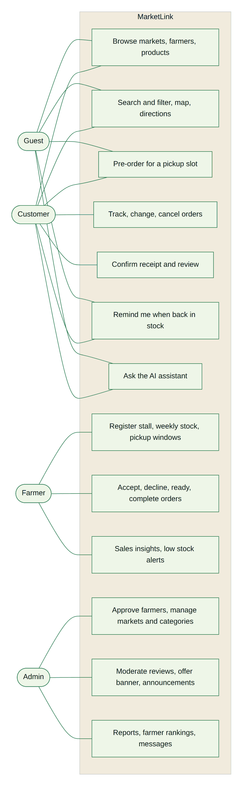

### 3.2 Data flow diagram – level 0 (context)

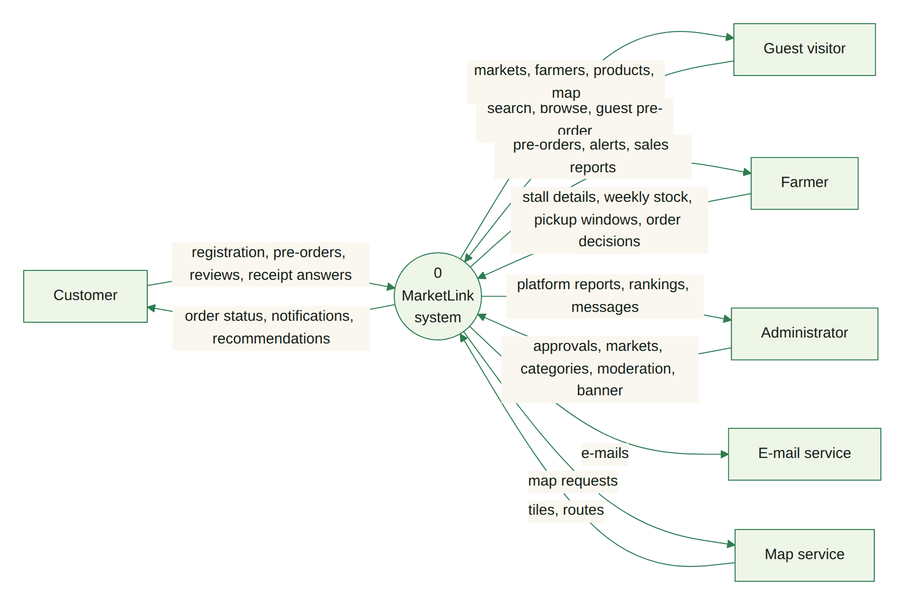

### 3.3 Data flow diagram – level 1

The level-1 diagram is split in two to keep it readable.

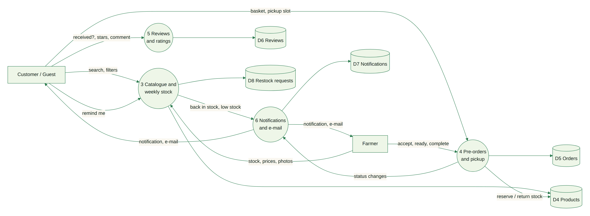

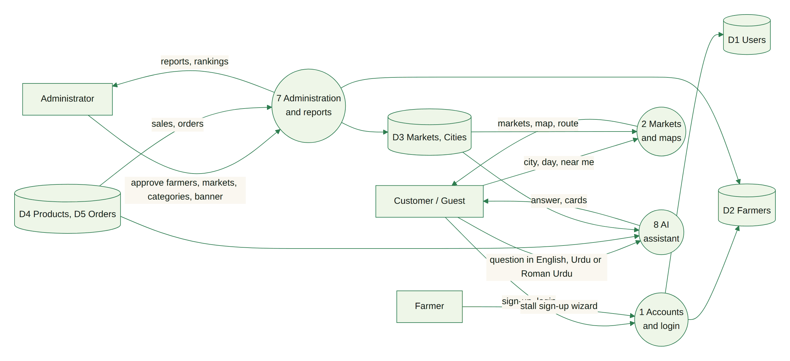

### 3.4 Flowchart – customer pre-order

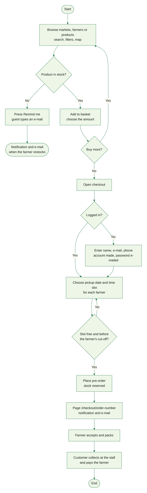

### 3.5 Flowchart – farmer registration and approval

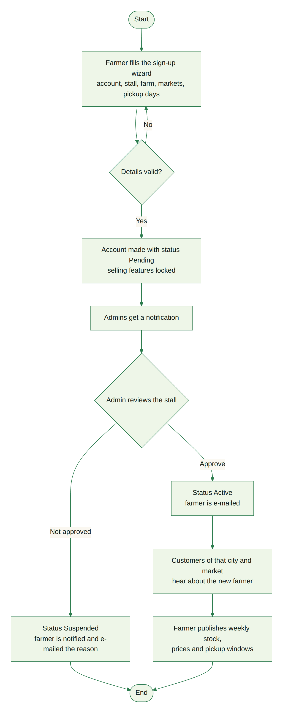

### 3.6 Flowchart – farmer handles a pre-order

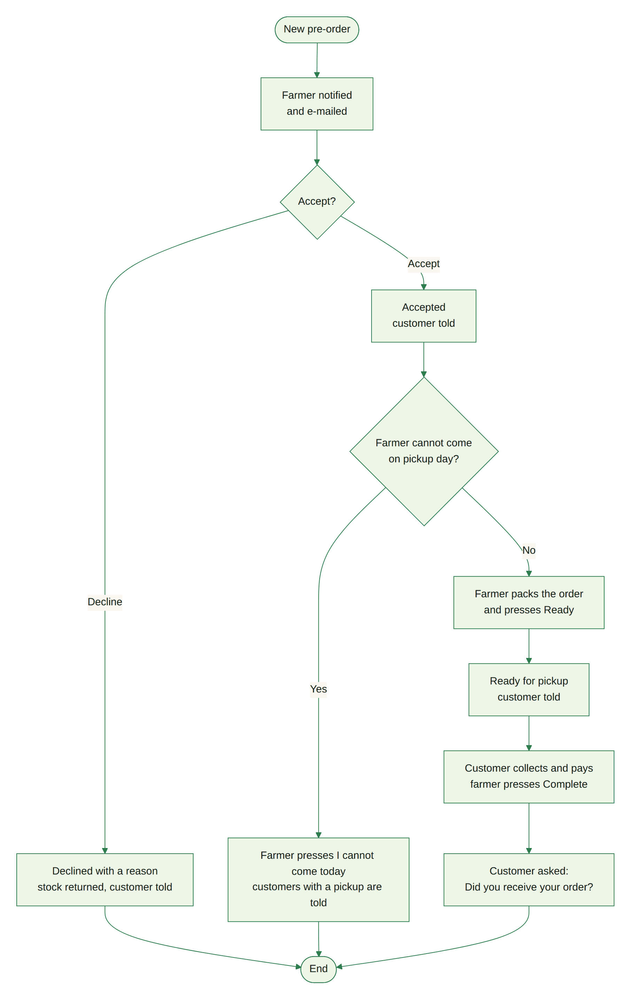

### 3.7 Flowchart – receipt confirmation and review

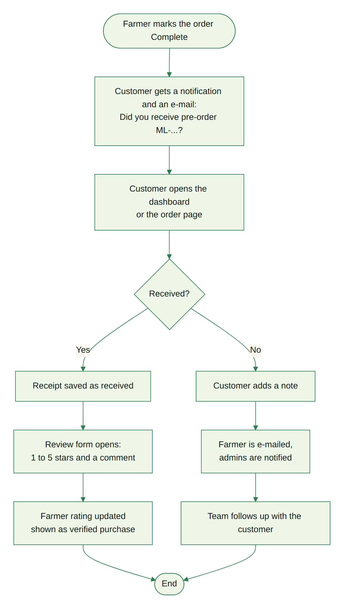

### 3.8 Flowchart – AI assistant

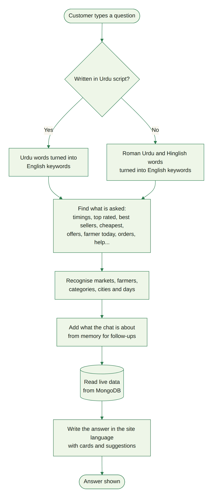

### 3.9 Order states

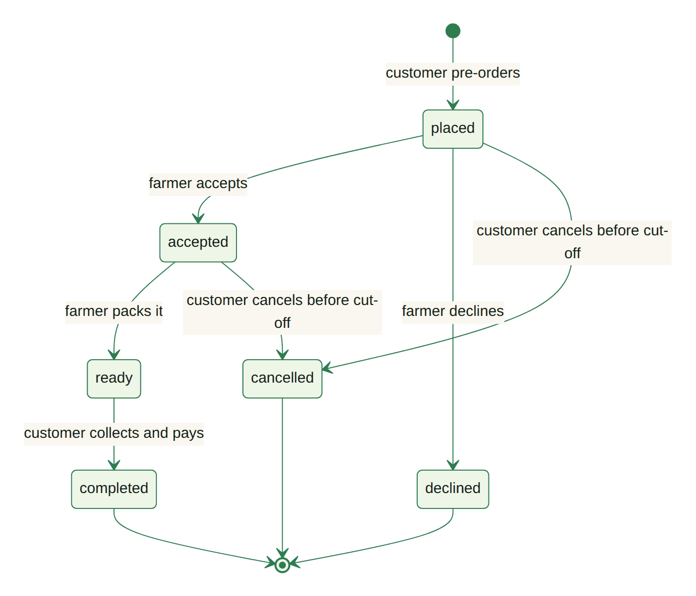

---

## 4. Database design

MongoDB stores the data in **19 collections**. The main entities and their relations are shown below;
the full list of fields follows. Relations are stored as references (ObjectId) except the order items
and pickup windows, which are stored inside their order or farmer document.

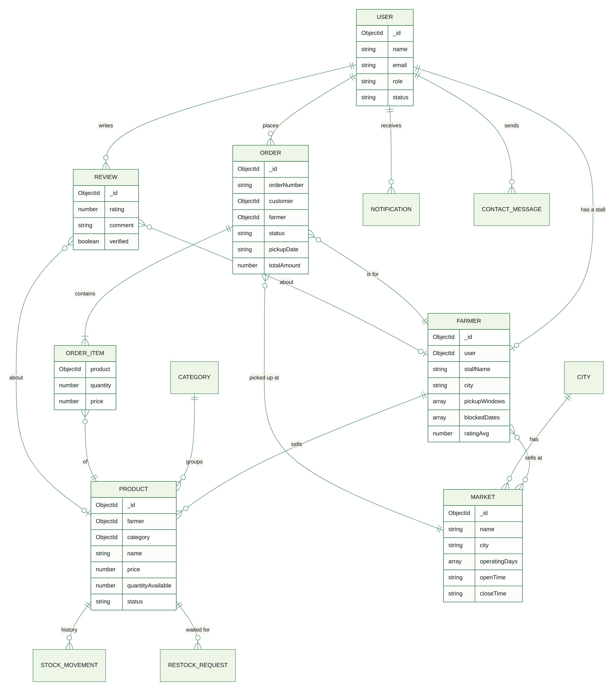

### 4.1 Collections

| Collection | Purpose |
| --- | --- |
| users | Every login: customers, farmers and administrators (role, status, favourites, family) |
| farmers | Stall profile of a farmer user: markets, days, pickup windows, closed dates, rating |
| markets | Farmers markets with address, days, hours and map position |
| cities | Master list of cities for markets and farmers |
| categories | Product categories (with Urdu name, photo and colour) |
| products | A farmer's product with price, unit, stock, status, photos and SEO fields |
| orders | Pre-orders with items, pickup slot, status history and receipt answer |
| reviews | Ratings and comments for farmers and products, with the farmer's reply |
| notifications | In-app messages for each user |
| stockmovements | History of every stock change (orders, restocks, template, corrections) |
| restockrequests | "Remind me when it is back" requests (customer or guest e-mail) |
| announcements | Platform notices, optionally for a season (months) |
| sitebanners | The home page offer banner the admin edits |
| contactmessages | Contact form messages with their topic |
| contentflags | Reports of inappropriate content for the moderation queue |
| faqs | Questions and answers (English and Urdu) |
| reports | Saved platform reports |
| subscribers | Newsletter subscribers |
| assistantchats | Saved chat history and memory of signed-in users |

### 4.2 Fields of each collection

The tables below list every field with its type and the rules checked by the database layer.

#### Announcement (collection `announcements`)

| Field | Type | Required | Rules / notes |
| --- | --- | --- | --- |
| title | String | Yes | max length 120 |
| message | String | Yes | max length 1000 |
| titleUr | String |  | max length 160 |
| messageUr | String |  | max length 1200 |
| audience | String |  | one of: all, customer, farmer; default "all" |
| months | Array<Number> |  | default [] |
| link | String |  | max length 200 |
| isActive | Boolean |  | default true |
| createdBy | ObjectId → User |  |  |
| _id | ObjectId | Yes | primary key |
| createdAt | Date |  | set automatically |
| updatedAt | Date |  | set automatically |

#### AssistantChat (collection `assistantchats`)

| Field | Type | Required | Rules / notes |
| --- | --- | --- | --- |
| user | ObjectId → User | Yes | unique |
| messages | Array of objects (from, text, cards, at) |  |  |
| memory.marketId | String |  |  |
| memory.marketName | String |  |  |
| memory.farmerId | String |  |  |
| memory.farmerName | String |  |  |
| memory.productId | String |  |  |
| memory.productName | String |  |  |
| memory.day | Number |  |  |
| memory.city | String |  |  |
| memory.name | String |  |  |
| memory.lastIntent | String |  |  |
| _id | ObjectId | Yes | primary key |
| createdAt | Date |  | set automatically |
| updatedAt | Date |  | set automatically |

Indexes: user 1 (unique)

#### Category (collection `categories`)

| Field | Type | Required | Rules / notes |
| --- | --- | --- | --- |
| name | String | Yes | unique; max length 60 |
| nameUr | String |  | max length 60 |
| slug | String | Yes | unique |
| description | String |  | max length 300 |
| icon | String |  |  |
| image | String |  |  |
| color | String |  | default "#E6F4DA" |
| sortOrder | Number |  | default 0 |
| isActive | Boolean |  | default true |
| _id | ObjectId | Yes | primary key |
| createdAt | Date |  | set automatically |
| updatedAt | Date |  | set automatically |

Indexes: name 1 (unique); slug 1 (unique)

#### City (collection `cities`)

| Field | Type | Required | Rules / notes |
| --- | --- | --- | --- |
| name | String | Yes | max length 60 |
| slug | String | Yes |  |
| province | String |  | max length 60; default "" |
| latitude | Number |  | min -90; max 90 |
| longitude | Number |  | min -180; max 180 |
| isActive | Boolean |  | default true |
| sortOrder | Number |  | default 0 |
| _id | ObjectId | Yes | primary key |
| createdAt | Date |  | set automatically |
| updatedAt | Date |  | set automatically |

Indexes: name 1 (unique); slug 1 (unique)

#### ContactMessage (collection `contactmessages`)

| Field | Type | Required | Rules / notes |
| --- | --- | --- | --- |
| name | String | Yes | max length 80 |
| email | String | Yes | max length 120 |
| subject | String |  | max length 150 |
| topic | String |  | one of: market_request, market_complaint, farmer_complaint, order_help, selling, feedback, other |
| message | String | Yes | max length 2000 |
| status | String |  | one of: new, read; default "new" |
| _id | ObjectId | Yes | primary key |
| createdAt | Date |  | set automatically |
| updatedAt | Date |  | set automatically |

#### ContentFlag (collection `contentflags`)

| Field | Type | Required | Rules / notes |
| --- | --- | --- | --- |
| targetType | String | Yes | one of: review, product, farmer |
| review | ObjectId → Review |  |  |
| product | ObjectId → Product |  |  |
| farmer | ObjectId → Farmer |  |  |
| reason | String | Yes | one of: spam, offensive, misleading, wrong_info, other, auto_language |
| note | String |  | max length 500 |
| reporter | ObjectId → User |  |  |
| status | String |  | one of: open, resolved, dismissed; default "open" |
| action | String |  | one of: none, removed, restored, suspended; default "none" |
| resolutionNote | String |  | max length 300 |
| resolvedBy | ObjectId → User |  |  |
| resolvedAt | Date |  |  |
| _id | ObjectId | Yes | primary key |
| createdAt | Date |  | set automatically |
| updatedAt | Date |  | set automatically |

Indexes: status 1, createdAt -1; targetType 1, review 1, product 1, farmer 1

#### Faq (collection `faqs`)

| Field | Type | Required | Rules / notes |
| --- | --- | --- | --- |
| question | String | Yes | max length 200 |
| answer | String | Yes | max length 1500 |
| questionUr | String |  | max length 300 |
| answerUr | String |  | max length 2500 |
| group | String |  | one of: shopping, pickup, farmers, account; default "shopping" |
| order | Number |  | default 0 |
| showOnHome | Boolean |  | default false |
| isActive | Boolean |  | default true |
| _id | ObjectId | Yes | primary key |
| createdAt | Date |  | set automatically |
| updatedAt | Date |  | set automatically |

Indexes: isActive 1, group 1, order 1

#### Farmer (collection `farmers`)

| Field | Type | Required | Rules / notes |
| --- | --- | --- | --- |
| user | ObjectId → User | Yes | unique |
| stallName | String | Yes | max length 100 |
| slug | String | Yes | unique |
| contactPerson | String | Yes |  |
| phone | String | Yes |  |
| email | String | Yes |  |
| address | String | Yes |  |
| city | String |  | default "" |
| bio | String |  | max length 1200 |
| bioUr | String |  | max length 1500 |
| tags | Array<String> |  |  |
| categories | Array<ObjectId → Category> |  |  |
| logo | String |  |  |
| coverImage | String |  |  |
| coverCredit.author | String |  |  |
| coverCredit.source | String |  |  |
| coverCredit.license | String |  |  |
| latitude | Number |  | min -90; max 90 |
| longitude | Number |  | min -180; max 180 |
| markets | Array<ObjectId → Market> |  |  |
| operatingDays | Array<Number> |  |  |
| pickupWindows | Array of objects (market, day, start, end) |  |  |
| slotMinutes | Number |  | min 10; max 240; default 30 |
| slotCapacity | Number |  | min 1; max 100; default 6 |
| orderCutoffHours | Number |  | min 0; max 168; default 12 |
| blockedDates | Array<String> |  |  |
| autoApplyTemplate | Boolean |  | default true |
| templateLastAppliedWeek | String |  |  |
| isActive | Boolean |  | default false |
| ratingAvg | Number |  | default 0 |
| ratingCount | Number |  | default 0 |
| _id | ObjectId | Yes | primary key |
| createdAt | Date |  | set automatically |
| updatedAt | Date |  | set automatically |

Indexes: user 1 (unique); slug 1 (unique); isActive 1; markets 1; operatingDays 1

#### Market (collection `markets`)

| Field | Type | Required | Rules / notes |
| --- | --- | --- | --- |
| name | String | Yes | max length 100 |
| slug | String | Yes | unique |
| description | String |  | max length 1000 |
| descriptionUr | String |  | max length 1200 |
| address | String | Yes |  |
| city | String |  | default "" |
| categories | Array<ObjectId → Category> |  |  |
| latitude | Number | Yes | min -90; max 90 |
| longitude | Number | Yes | min -180; max 180 |
| mapProvider | String |  | one of: openstreetmap, google; default "openstreetmap" |
| mapLink | String |  |  |
| operatingDays | Array<Number> |  |  |
| openTime | String |  | default "07:00" |
| closeTime | String |  | default "13:00" |
| image | String |  |  |
| imageCredit.author | String |  |  |
| imageCredit.source | String |  |  |
| imageCredit.license | String |  |  |
| isActive | Boolean |  | default true |
| liveNoticeDate | String |  |  |
| _id | ObjectId | Yes | primary key |
| createdAt | Date |  | set automatically |
| updatedAt | Date |  | set automatically |

Indexes: slug 1 (unique); isActive 1, city 1; categories 1

#### Notification (collection `notifications`)

| Field | Type | Required | Rules / notes |
| --- | --- | --- | --- |
| user | ObjectId → User | Yes |  |
| type | String |  | one of: order, restock, stock, announcement, review, account, moderation, system; default "system" |
| title | String | Yes |  |
| message | String | Yes |  |
| link | String |  |  |
| read | Boolean |  | default false |
| _id | ObjectId | Yes | primary key |
| createdAt | Date |  | set automatically |
| updatedAt | Date |  | set automatically |

Indexes: user 1, read 1, createdAt -1

#### Order (collection `orders`)

| Field | Type | Required | Rules / notes |
| --- | --- | --- | --- |
| orderNumber | String | Yes | unique |
| customer | ObjectId → User | Yes |  |
| farmer | ObjectId → Farmer | Yes |  |
| market | ObjectId → Market | Yes |  |
| items | Array of objects (product, name, nameUr, image, unit, price) |  |  |
| totalAmount | Number | Yes | min 0 |
| pickupDate | String | Yes |  |
| pickupSlot.start | String | Yes |  |
| pickupSlot.end | String | Yes |  |
| pickupAt | Date | Yes |  |
| cutoffAt | Date | Yes |  |
| status | String |  | one of: placed, accepted, ready, completed, declined, cancelled; default "placed" |
| statusHistory | Array of objects (status, at, by, note) |  |  |
| customerNote | String |  | max length 500 |
| placedBy | String |  | one of: customer, admin; default "customer" |
| farmerNote | String |  | max length 500 |
| paymentMethod | String |  | default "pay_at_pickup" |
| completedAt | Date |  |  |
| receipt.status | String |  | one of: received, not_received |
| receipt.note | String |  | max length 500 |
| receipt.at | Date |  |  |
| _id | ObjectId | Yes | primary key |
| createdAt | Date |  | set automatically |
| updatedAt | Date |  | set automatically |

Indexes: orderNumber 1 (unique); customer 1, createdAt -1; farmer 1, status 1, pickupDate 1; market 1

#### Product (collection `products`)

| Field | Type | Required | Rules / notes |
| --- | --- | --- | --- |
| farmer | ObjectId → Farmer | Yes |  |
| name | String | Yes | max length 100 |
| nameUr | String |  | max length 100 |
| slug | String |  |  |
| category | ObjectId → Category | Yes |  |
| price | Number | Yes | min 0 |
| compareAtPrice | Number |  | min 0 |
| unit | String |  | one of: kg, g, lb, dozen, piece, bunch, litre, pack, jar, loaf, box; default "kg" |
| quantityAvailable | Number |  | min 0; default 0 |
| templateQuantity | Number |  | min 0; default 0 |
| lowStockThreshold | Number |  | min 0; max 100000; default 5 |
| lowStockAlertedAt | Date |  |  |
| soldOutAlertedAt | Date |  |  |
| description | String |  | max length 1500 |
| descriptionUr | String |  | max length 1800 |
| metaTitle | String |  | max length 70 |
| metaDescription | String |  | max length 170 |
| keywords | Array<String> |  | default [] |
| aiSchema.summary | String |  | max length 300 |
| aiSchema.season | String |  | max length 80 |
| aiSchema.storage | String |  | max length 200 |
| aiSchema.uses | String |  | max length 200 |
| aiSchema.usesUr | String |  | max length 250 |
| aiSchema.storageUr | String |  | max length 250 |
| aiSchema.source | String |  | one of: claude, builtin, farmer |
| aiSchema.generatedAt | Date |  |  |
| image | String |  |  |
| gallery | Array of objects (url, credit.author, credit.source, credit.license) |  |  |
| imageCredit.author | String |  |  |
| imageCredit.source | String |  |  |
| imageCredit.license | String |  |  |
| status | String |  | one of: available, sold_out, unavailable; default "available" |
| isRemoved | Boolean |  | default false |
| removedReason | String |  |  |
| deletedByFarmer | Boolean |  | default false |
| markets | Array<ObjectId → Market> |  |  |
| days | Array<Number> |  |  |
| farmerActive | Boolean |  | default true |
| ratingAvg | Number |  | default 0 |
| ratingCount | Number |  | default 0 |
| totalSold | Number |  | default 0 |
| _id | ObjectId | Yes | primary key |
| createdAt | Date |  | set automatically |
| updatedAt | Date |  | set automatically |

Indexes: slug 1; farmer 1, isRemoved 1; category 1, price 1; markets 1; days 1; keywords 1

#### Report (collection `reports`)

| Field | Type | Required | Rules / notes |
| --- | --- | --- | --- |
| generatedBy | ObjectId → User | Yes |  |
| reportType | String | Yes | one of: platform_overview, orders_summary, revenue_by_market, top_farmers, sales_by_category, customer_activity, inventory_status, city_overview, reviews_moderation |
| title | String |  |  |
| from | Date |  |  |
| to | Date |  |  |
| data | Mixed |  |  |
| _id | ObjectId | Yes | primary key |
| generatedAt | Date |  |  |

#### RestockRequest (collection `restockrequests`)

| Field | Type | Required | Rules / notes |
| --- | --- | --- | --- |
| product | ObjectId → Product | Yes |  |
| user | ObjectId → User |  |  |
| email | String | Yes | max length 120 |
| _id | ObjectId | Yes | primary key |
| createdAt | Date |  | set automatically |
| updatedAt | Date |  | set automatically |

Indexes: product 1, email 1 (unique)

#### Review (collection `reviews`)

| Field | Type | Required | Rules / notes |
| --- | --- | --- | --- |
| type | String | Yes | one of: product, farmer |
| product | ObjectId → Product |  |  |
| farmer | ObjectId → Farmer | Yes |  |
| customer | ObjectId → User | Yes |  |
| order | ObjectId → Order |  |  |
| verified | Boolean |  | default false |
| rating | Number | Yes | min 1; max 5 |
| comment | String |  | max length 1000 |
| response.text | String |  | max length 1000 |
| response.at | Date |  |  |
| isRemoved | Boolean |  | default false |
| removedReason | String |  |  |
| _id | ObjectId | Yes | primary key |
| createdAt | Date |  | set automatically |
| updatedAt | Date |  | set automatically |

Indexes: product 1, isRemoved 1; farmer 1, isRemoved 1; customer 1, order 1

#### SiteBanner (collection `sitebanners`)

| Field | Type | Required | Rules / notes |
| --- | --- | --- | --- |
| key | String | Yes | unique; max length 40 |
| isActive | Boolean |  | default true |
| percent | Number |  | min 0; max 90; default 30 |
| autoPercent | Boolean |  | default false |
| tag | String |  | max length 40 |
| tagUr | String |  | max length 60 |
| title | String |  | max length 90 |
| titleUr | String |  | max length 120 |
| text | String |  | max length 220 |
| textUr | String |  | max length 300 |
| buttonLabel | String |  | max length 30 |
| buttonLabelUr | String |  | max length 40 |
| link | String |  | max length 200 |
| image | String |  |  |
| updatedBy | ObjectId → User |  |  |
| _id | ObjectId | Yes | primary key |
| createdAt | Date |  | set automatically |
| updatedAt | Date |  | set automatically |

Indexes: key 1 (unique)

#### StockMovement (collection `stockmovements`)

| Field | Type | Required | Rules / notes |
| --- | --- | --- | --- |
| farmer | ObjectId → Farmer | Yes |  |
| product | ObjectId → Product | Yes |  |
| productName | String | Yes |  |
| productNameUr | String |  |  |
| unit | String |  |  |
| change | Number | Yes |  |
| quantityAfter | Number | Yes | min 0 |
| type | String | Yes | one of: initial, restock, adjustment, waste, stall_sale, correction, template, order_reserved, order_released, order_changed |
| reason | String |  | max length 200 |
| order | ObjectId → Order |  |  |
| orderNumber | String |  |  |
| by | String |  | one of: farmer, customer, admin, system; default "system" |
| _id | ObjectId | Yes | primary key |
| createdAt | Date |  | set automatically |
| updatedAt | Date |  | set automatically |

Indexes: farmer 1, createdAt -1; product 1, createdAt -1

#### Subscriber (collection `subscribers`)

| Field | Type | Required | Rules / notes |
| --- | --- | --- | --- |
| email | String | Yes | max length 120 |
| name | String |  | max length 80 |
| source | String |  | one of: home, footer, checkout, admin; default "footer" |
| status | String |  | one of: subscribed, unsubscribed; default "subscribed" |
| token | String |  |  |
| unsubscribedAt | Date |  |  |
| _id | ObjectId | Yes | primary key |
| createdAt | Date |  | set automatically |
| updatedAt | Date |  | set automatically |

Indexes: email 1 (unique); token 1

#### User (collection `users`)

| Field | Type | Required | Rules / notes |
| --- | --- | --- | --- |
| name | String | Yes | max length 80 |
| email | String | Yes | unique |
| password | String | Yes |  |
| role | String |  | one of: customer, farmer, admin; default "customer" |
| phone | String |  |  |
| address | String |  | max length 250 |
| city | String |  | max length 60 |
| status | String |  | one of: active, pending, suspended, inactive; default "active" |
| avatar | String |  |  |
| favoriteFarmers | Array<ObjectId → Farmer> |  |  |
| favoriteProducts | Array<ObjectId → Product> |  |  |
| savedMarkets | Array<ObjectId → Market> |  |  |
| household | ObjectId → User |  |  |
| lastLoginAt | Date |  |  |
| termsAcceptedAt | Date |  |  |
| termsVersion | String |  |  |
| resetPasswordHash | String |  |  |
| resetPasswordExpires | Date |  |  |
| _id | ObjectId | Yes | primary key |
| createdAt | Date |  | set automatically |
| updatedAt | Date |  | set automatically |

Indexes: email 1 (unique); role 1, status 1

### 4.3 Database scripts

MongoDB does not use SQL, so the SRS's `.sql` files are replaced by:

- `database/marketlink-schema.mongodb.js` – creates the collections with their validation rules and
  indexes (run with `mongosh`).
- `database/sample-data/` – the demo data as JSON files that can be imported with MongoDB Compass or
  `mongoimport`.
- `npm run seed` – fills a fresh database with the same demo data.

---

## 5. Test data used

The demo data is created by `npm run seed` and is the data used for every test in the test report.

#### Record counts after `npm run seed`

| Data | Records | Details |
| --- | --- | --- |
| Users | 21 | 1 administrator; 12 farmers (10 approved, 1 waiting for approval, 1 suspended); 8 customers (7 active, 1 deactivated) |
| Cities | 9 | Karachi, Lahore, Islamabad, Rawalpindi, Hyderabad, Faisalabad, Multan, Peshawar, Quetta |
| Markets | 8 | 6 in Karachi, 1 in Lahore, 1 in Islamabad (table below) |
| Categories | 8 | Vegetables, Fruits, Dairy & Eggs, Baked Goods, Herbs & Greens, Honey & Preserves, Grains & Pulses, Flowers & Plants |
| Products | 62 | 15 Fruits, 15 Vegetables, 7 Baked Goods, 6 Flowers & Plants, 6 Dairy & Eggs, 5 Honey & Preserves, 4 Herbs & Greens, 4 Grains & Pulses; 60 in stock, 2 sold out; 8 on offer; prices Rs 50 to Rs 3,200 |
| Pre-orders | 435 | Pickup dates 1 August to 2 October 2026: 371 completed, 24 cancelled, 32 declined, and upcoming ones: 3 placed, 3 accepted, 2 ready |
| Reviews | 341 | 188 farmer reviews and 153 product reviews, most with a verified purchase; some with farmer replies |
| Stock movements | 81 | Restocks, weekly template runs, corrections and order reservations |
| Notifications | 11 | Order updates, alerts and announcements for the demo accounts |
| Announcements | 5 | Including seasonal notices shown only in their months |
| FAQs | 17 | English and Urdu, some shown on the home page |
| Content flags | 3 | Reports waiting in the moderation queue |
| Contact messages | 2 | Example messages for the admin inbox |
| Newsletter subscribers | 6 | |
| Saved reports | 1 | An example platform report |

#### Markets

| Market | City | Days | Hours |
| --- | --- | --- | --- |
| Clifton Seaview Farmers Market | Karachi | Sunday, Saturday | 07:00 to 13:00 |
| DHA Phase 6 Weekend Market | Karachi | Sunday, Friday | 08:00 to 14:00 |
| Gulshan Sunday Kisan Bazaar | Karachi | Sunday, Wednesday | 07:00 to 15:00 |
| North Nazimabad Evening Green Market | Karachi | Wednesday, Saturday | 16:00 to 21:00 |
| Bahadurabad Fresh Friday Market | Karachi | Tuesday, Friday | 16:00 to 21:00 |
| Saddar Heritage Farmers Market | Karachi | Monday, Thursday, Saturday | 06:00 to 12:00 |
| Model Town Kisan Market | Lahore | Sunday, Thursday | 07:00 to 13:00 |
| F-9 Park Weekend Market | Islamabad | Sunday, Saturday | 08:00 to 14:00 |

#### Farmers

| Stall | City | Status | Rating (reviews) |
| --- | --- | --- | --- |
| Malir Green Fields | Karachi | Approved | 4.55 (56) |
| Gadap Orchard Co. | Karachi | Approved | 4.29 (41) |
| Thatta Dairy Collective | Karachi | Approved | 4.28 (39) |
| Karachi Artisan Bakehouse | Karachi | Approved | 4.41 (39) |
| Hyderabad Herb Garden | Karachi | Approved | 4.25 (32) |
| Kirthar Honey & Preserves | Karachi | Approved | 4.41 (17) |
| Indus Grains & Pulses | Karachi | Approved | 4.49 (43) |
| Bloom & Bough Nursery | Karachi | Approved | 4.52 (25) |
| Ravi Organic Farm | Lahore | Approved | 4.25 (20) |
| Margalla Hills Farm | Islamabad | Approved | 4.36 (28) |
| Sunny Acres Poultry | Karachi | Waiting for approval | - |
| Old Town Goat Dairy | Karachi | Suspended | - |

#### Example inputs used in the tests

| Input | Values used |
| --- | --- |
| New accounts | Customer "New User" (new@x.com, +92 300 1234567, password Passw0rd); a sign-up without accepting the terms (noterms@x.com, refused); a farmer through the sign-up wizard; the browser test types the phone as +92 321 5551234 and checks it is saved as +923215551234 |
| Invalid inputs | Empty required fields, wrong e-mail format, short password, phone with letters, price below zero, percent over 90, an outside web link |
| Pre-orders | 1 to 3 items from one or two farmers, the next free pickup slot, guest checkout with a new e-mail |
| Search words | mango, tomato, honey, "hon" (partial), Urdu and Roman Urdu words such as "tamatar" |
| Assistant questions | "which farmer is highly rated", "sab se acha kisan kaunsa hai?", "tamatar kahan milega", "sab se sasti sabzi", Urdu "سب سے اچھی ریٹنگ والا کسان کون ہے؟" |

**Special cases in the data, so every screen can be tried:**

- A farmer waiting for approval (Sunny Acres Poultry) and a suspended farmer (Old Town Goat Dairy).
- A deactivated customer, and a family account (Omar Khan shares Ayesha Khan's household).
- Products on offer (a higher "before" price), sold-out and low-stock products.
- Pre-orders in every status, including upcoming ones for today and the coming days, and one completed
  pickup the demo customer has not yet confirmed (so "Did you receive your order?" can be tried).
- A closed date for Bloom & Bough Nursery next Friday, reviews with farmer replies, reported content in
  the moderation queue, seasonal announcements and newsletter subscribers.

---

## 6. Installation instructions

**Requirements:** Node.js 20 or newer, and MongoDB (MongoDB Community Server on the computer, or a free
MongoDB Atlas cluster).

1. Open a terminal in the `MarketLink` folder.
2. Install everything: `npm run install:all`
3. Copy `server/.env.example` to `server/.env` and set `MONGO_URI` (for example
   `mongodb://127.0.0.1:27017/marketlink`) and a long random `JWT_SECRET`.
4. (Optional) Create the collections and indexes: run `database/marketlink-schema.mongodb.js` with `mongosh`.
5. Load the demo data: `npm run seed` (this deletes existing MarketLink data).
6. Start the app for development: `npm run dev`, then open http://localhost:5173
7. Or build and run one server: `npm run build` and `npm start`, then open http://localhost:5000

**E-mail:** without SMTP settings the e-mails are printed in the server window. To send real e-mails, put
the SMTP details (for example a Gmail address and app password) in `server/.env` and run
`npm run mail:test`.

**Urdu:** press **اردو** in the top bar, or open any page with `?lang=ur`.

**Ready-to-run copy:** the "Complete" zip already contains the built app and the server's packages, so
only MongoDB, `server/.env` and `npm run seed` / `npm start` are needed (see `HOW-TO-RUN.txt`).

---

## 7. User credentials

All accounts are created by `npm run seed`. Everyone logs in on the same page, `/login`.

| Role | E-mail | Password |
| --- | --- | --- |
| Administrator | admin@marketlink.com | Admin@123 |
| Farmer (approved) – Malir Green Fields | farmer@marketlink.com | Farmer@123 |
| Farmer (waiting for approval) – Sunny Acres Poultry | pending.farmer@marketlink.com | Farmer@123 |
| Farmer (suspended, cannot log in) – Old Town Goat Dairy | suspended.farmer@marketlink.com | Farmer@123 |
| Other approved farmers | orchard@, dairy@, bakery@, herbs@, honey@, grains@, nursery@, lahore.farm@, islamabad.farm@ marketlink.com | Farmer@123 |
| Customer – Ayesha Khan | customer@marketlink.com | Customer@123 |
| Customer – Omar Khan (Ayesha's family member) | omar@marketlink.com | Customer@123 |
| Other customers | bilal@, sara@, usman@, fatima@, hamza@ marketlink.com | Customer@123 |
| Customer (deactivated, cannot log in) | inactive.customer@marketlink.com | Customer@123 |

---

## 8. SRS functional requirements and where to find them

| SRS requirement | Where it is in MarketLink |
| --- | --- |
| Customer registration and login with name, contact number, e-mail and address | `/register`, `/login`; phone box with country flag |
| Favourite farmers and products | Heart buttons; Account → Favourites |
| Family account sharing (optional) | Account → Profile → Family |
| Browse markets by location and day, farmers at each market | `/markets` (open today first), market page with each farmer's status today |
| Farmer profile: stall, location, days, weekly stock | `/farmers/<name>` |
| Map with markers and directions | `/map`, market and farmer pages (OpenStreetMap, OSRM route, Google Maps link) |
| Categories and filters for price, category, market and day | `/products` filters, `/categories` |
| Product details: price, unit, quantity, farmer | `/products/<name>` |
| Basket and pre-order against stock, pickup date and slot | Basket, `/checkout` |
| Order status, cancel or modify before cut-off | Account → Orders → order page |
| Order history, reorder, favourites, restock alerts | Account → Orders, "Order again", Remind me |
| Preferred market and route-friendly pickup details | Account → Favourites → Saved markets, order page directions |
| AI assistant | Chat button on every page |
| Reviews and ratings after completion, visible before ordering | Receipt question, review form, product and farmer pages |
| Farmer registration details and profile (markets, days, windows, map pin) | `/register/farmer` wizard, Farmer → Profile, Pickup |
| Products: add, edit, view, delete; weekly template; sold out / unavailable | Farmer → Products, Inventory |
| Pre-orders: accept, decline, ready; cut-off and slots | Farmer → Orders, Pickup |
| Sales history, best sellers, total / pending orders, revenue | Farmer → Dashboard, Sales |
| Reply to reviews | Farmer → Reviews |
| Admin dashboard with platform totals | `/admin` |
| Approve or suspend farmers; activate or deactivate customers | Admin → Farmers, Customers |
| Manage markets with map position | Admin → Markets |
| Remove inappropriate listings or reviews | Admin → Moderation, Products, Reviews |
| Reports: orders, revenue by market, most active farmers | Admin → Reports, farmer rankings |
| Categories and announcements | Admin → Categories, Announcements (plus the offer banner) |
| Role-based access | Server checks the role on every protected request |
| Search, sort, filter with map results | Shop, farmers, markets, map pages |
| Responsive design | Every page, phone bottom bar |
| E-mail or in-app notifications | Bell menu, Notifications page, e-mails |
| About us, contact us with map | `/about`, `/contact` |

---

## 9. Features added beyond the SRS

Urdu language with right-to-left layout; guest checkout; the "Did you receive your order?" check before
reviews; restock reminders for guests and customers; "I cannot come today" for farmers and the live
"at the market today" badge; notices when a market opens today or a new farmer joins; best sellers
(top 5 / 10 / 20 per market); admin farmer rankings; an admin-edited offer banner; low-stock alerts and
stock history; AI-written product descriptions; SEO (search-engine friendly pages, sitemap, structured
data); contact topics (for example "Request a new market"); a newsletter; FAQs.

---

## 10. Assumptions

- Payment is made in person at pickup; there is no payment gateway (SRS 1.5).
- Pickup only; no delivery (SRS 1.5).
- Farmer identity and organic or food-safety claims are not verified; tags such as "Pesticide-free"
  are the farmer's own description (SRS 1.5).
- All markets use one time zone (Asia/Karachi by default) for pickup slots, cut-off times and "today".
- The e-mail address is the login name (the SRS example table's `username`).
- The project uses MongoDB, so the database is described with a `mongosh` script and JSON sample data
  instead of `.sql` files.
- OpenStreetMap is used instead of the paid Google Maps API; Google Maps links are offered for directions.
- Stock photos come from the Open Images Dataset under the CC BY 2.0 licence; their photographers are
  listed on the website's **Photo credits** page.

---

## 11. AI tools used (SRS requirement)

| Tool | What it was used for |
| --- | --- |
| Claude Code (Anthropic) | Coding assistant during development, tests, and the first draft of this report and the test report |
| Canva | Logo design |
| EDSR super-resolution model (OpenCV) | Enlarging the 1024 px banner photos to 1920 px for large screens |
| *(add any other tools your team used)* | |
